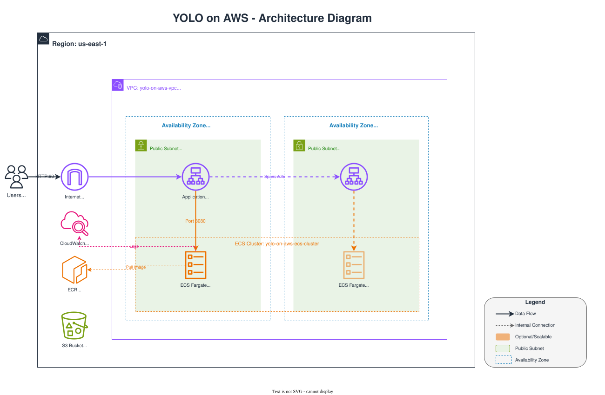

# yolo-on-aws

## 初回デプロイ手順

### tfvarsファイル作成

```bash
cp infra/dev.tfvars.example infra/dev.tfvars
# execution_role_arnに適切なIAMロールARNを設定
```

### Bootstrap (S3バケット作成)

```bash
cd infra/bootstrap
terraform init
terraform apply
```

### ECRリポジトリ作成 & Dockerイメージプッシュ

```bash
cd ../  # infraディレクトリに戻る
terraform init
terraform apply -target=aws_ecr_repository.api -var="image_uri=dummy"  # ECRリポジトリのみ作成

bash api-push.sh
# 出力されたIMAGE_URIをコピーし、dev.tfvarsのimage_uriに貼り付けて保存
```

### インフラ全体をデプロイ

```bash
cd infra
terraform apply
```

デプロイ完了後、出力されたALBのURLにアクセス：

```text
http://yolo-on-aws-alb-xxxxx.us-east-1.elb.amazonaws.com/healthz
```

## ECSサービスの起動/停止（コスト節約）

### サービスを停止（料金発生を止める）

```bash
aws ecs update-service \
  --cluster yolo-on-aws-ecs-cluster \
  --service yolo-on-aws-api-service \
  --desired-count 0 \
  --region us-east-1
```

### サービスを起動（使いたい時）

```bash
aws ecs update-service \
  --cluster yolo-on-aws-ecs-cluster \
  --service yolo-on-aws-api-service \
  --desired-count 1 \
  --region us-east-1
```

### 現在の状態を確認

```bash
aws ecs describe-services \
  --cluster yolo-on-aws-ecs-cluster \
  --services yolo-on-aws-api-service \
  --region us-east-1 \
  --query 'services[0].{RunningCount:runningCount,DesiredCount:desiredCount}' \
  --output json
```

## 再デプロイ（コード変更時）

### Dockerイメージを再ビルド & プッシュ

```bash
bash api-push.sh
```

### ECSサービスを強制的に再デプロイ

```bash
aws ecs update-service \
  --cluster yolo-on-aws-ecs-cluster \
  --service yolo-on-aws-api-service \
  --force-new-deployment \
  --region us-east-1
```

## インフラ削除（完全に削除する場合）

```bash
cd infra
terraform destroy
```

## infra構成


